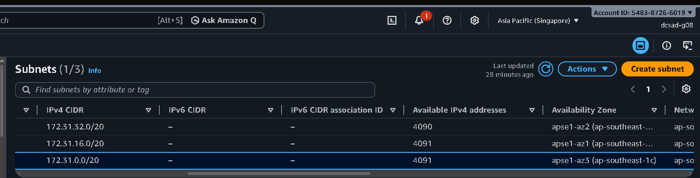
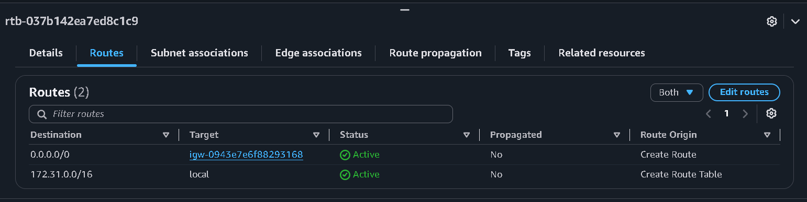
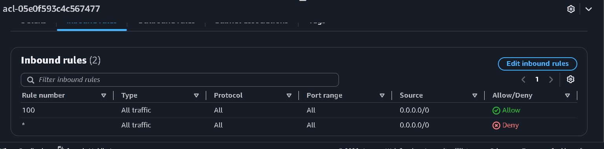
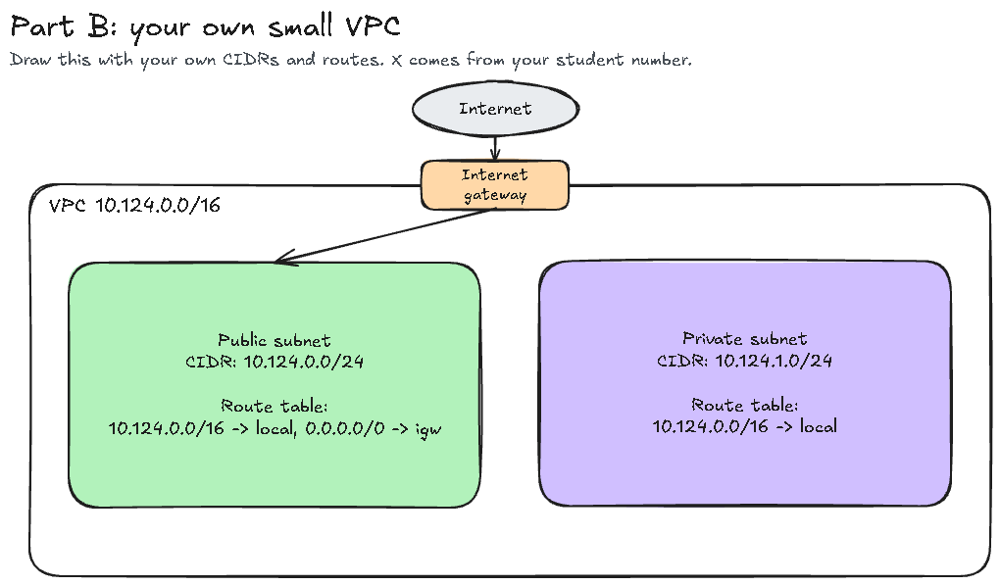

# Assignment 2 Submission

## About me

- GitHub username: jdyyy1
- Section: IV-DCSAD
- IAM user name that I signed in with: dcsad-g08
- X: 124

---

## Part A. Explore

### A1. The VPC

Default VPC IPv4 CIDR:

172.31.0.0/16

Number of addresses in that CIDR:

65,536

### A2. The subnets

| Availability Zone | IPv4 CIDR |
| --- | --- |
| apse1-az2 (ap-southeast-1a) | 172.31.32.0/20 |
| apse1-az1 (ap-southeast-1b) | 172.31.16.0/20 |
| apse1-az3 (ap-southeast-1c) | 172.31.0.0/20 |

Screenshot 1. Save it as `screenshot-1-subnets.png` in your folder. The image line below shows it.

### A3. Available addresses

Available IPv4 addresses in each subnet:

apsei1-az2 4,090, apsei1-az1 4,091, apsei1-az3 4,091.

Why is the number lower than 4,096?

While a /20 CIDR block gives you 4,096 total IP addresses mathematically, AWS automatically reserves 5 addresses in every subnet for its own internal infrastructure. These 5 IPs cover the network address, VPC router, DNS server, AWS future reservation, and network broadcast.So, in a completely fresh and empty subnet, you'll always start with 4,091 usable IPs ($4,096 - 5$).

What uses the missing address in the subnet with the lowest number?

apse1-az2 only has 4,090 available addresses, which is 1 short of the expected 4,091. That missing IP is actively assigned to a resource running inside that subnet. It's bound to an Elastic Network Interface (ENI) attached to something like an active EC2 instance, a NAT Gateway, a Load Balancer, or an AWS service endpoint.

### A4. The route table

| Destination | Target |
| --- | --- |
| 0.0.0.0/0 | igw-... |
| 172.31.0.0/16 | local |

Screenshot 2. Save it as `screenshot-2-routes.png` in your folder. The image line below shows it.

### A5. Public or private

Are the default subnets public or private? Which route proves it?

The default subnets are public because the route sending all internet traffic (0.0.0.0/0) points directly to an Internet Gateway target (igw-...).

### A6. The internet gateway

State of the internet gateway:

Attached

What happens to the default subnets if the gateway is detached?

If the gateway is detached, the route targeting 0.0.0.0/0 becomes inactive and loses its path to the internet. As a result, instances in the default subnets lose all external internet connectivity, though they can still communicate with each other locally within the VPC using the local route.

### A7. NAT gateways

Number of NAT gateways:

0

Can a server in a new private subnet download updates? Why?

No. A server in a new private subnet cannot download updates because there is no NAT Gateway to route outbound internet requests, and a private subnet's route table lacks a 0.0.0.0/0 route to the internet. To enable updates, you must create a NAT Gateway in a public subnet and add a 0.0.0.0/0 route pointing to it in the private subnet's route table.

### A8. The network ACL

| Rule number | Source | Allow or Deny |
| --- | --- | --- |
| 100 | 0.0.0.0/0 | Allow |
| * | 0.0.0.0/0 | Deny |

How is a network ACL different from a security group?

A Network ACL controls traffic at the subnet level, whereas a Security Group works at the individual instance level. Network ACLs are also stateless (outbound responses require explicit rules) and support Deny rules—which Security Groups do not.

Screenshot 3. Save it as `screenshot-3-network-acl.png` in your folder. The image line below shows it.

### A9. The default security group

Inbound rule (type and source):

All traffic from sg-... (the Security Group ID of the default security group itself)

Which resources can send traffic to an instance that uses it?

Only other resources assigned to this exact same default security group can send inbound traffic. Since no other inbound rules exist, all traffic coming from external sources or other security groups is blocked by default.

---

## Part B. Prepare

### B1. Plan two subnets

- Public subnet CIDR: 10.124.0.0/24
- Private subnet CIDR: 10.124.1.0/24

### B2. Route tables

Route table of the public subnet:

| Destination | Target |
| --- | --- |
| 10.124.0.0/16 | local |
| 0.0.0.0/0 | internet gateway |

Route table of the private subnet:

| Destination | Target |
| --- | --- |
| 10.124.0.0/16 | local |

### B3. My VPC diagram

Tool used (Excalidraw, draw.io, Lucidchart, or paper):

Excalidraw

Save your diagram as `vpc-diagram.png` in your folder. The image line below shows it.

### B4. Predict a change

Can you still open the web page from your laptop? Why?

No. Removing the `0.0.0.0/0` route cuts the path between the internet and the subnet. Incoming HTTP requests from your browser can no longer reach the instance, and outbound response traffic cannot route back to your laptop.

Can the instance still reach another instance in the VPC? Why?

Yes. The `10.124.0.0/16 local` route is still active in the route table, allowing all instances within the same VPC to route traffic directly to each other.

### B5. Place a database

Which subnet gets the database? Why?

The private subnet. Databases contain sensitive data and should not be exposed directly to the public internet. Placing it in the private subnet prevents direct external access while keeping it accessible internally to backend application servers via the local VPC route.

### B6. My question about VPCs

What is your question, and what made you think of it?

How do instances in a private subnet receive security patches or download software dependencies if they don't have direct access to an Internet Gateway or a NAT Gateway? I thought of this after seeing that our test VPC had no NAT Gateway configured, yet private servers often still need updates.
